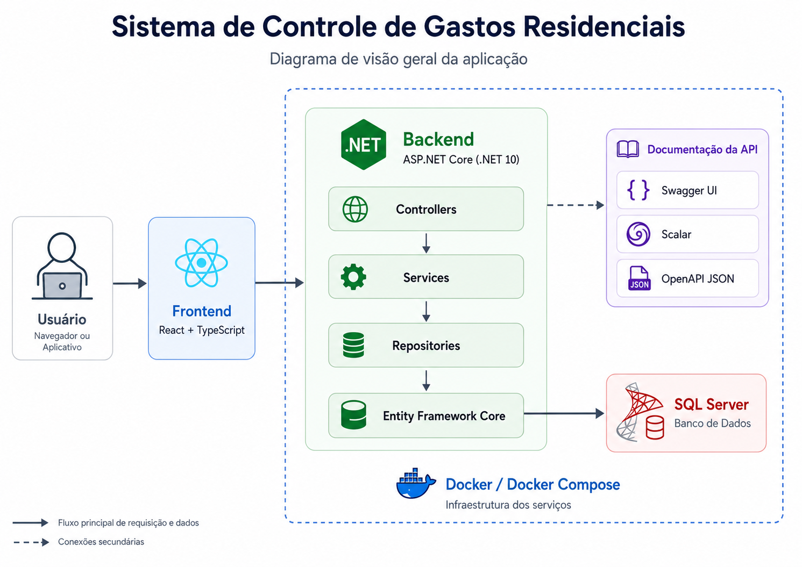

# Sistema de Controle de Gastos Residenciais

<div align="center">
  
  
  
  
  
</div>

Sistema web para controle de gastos residenciais, com cadastro de pessoas, contas e transações, aplicação de regras de negócio e persistência relacional.

> **Versão atual:** `v0.0.1`  
> **Estágio:** Em desenvolvimento

## Sumário

- [Visão geral](#visão-geral)
- [Recursos utilizados](#recursos-utilizados)
- [Arquitetura e padrões](#arquitetura-e-padrões)
- [Decisões técnicas](#decisões-técnicas)
- [Documentação](#documentação)
- [Como executar](#como-executar)
- [Documentação da API](#documentação-da-api)
- [Relato de bugs](#relato-de-bugs)

## Visão geral

A aplicação foi estruturada com foco em separação de responsabilidades, manutenção e evolução do código.

O backend utiliza ASP.NET Core, Entity Framework Core e SQL Server. A interface será desenvolvida com React e TypeScript.

<div align="center">
  
</div>

## Recursos utilizados

| Recurso | Aplicação no projeto | Justificativa |
| :--- | :--- | :--- |
| **C# / .NET 10** | Backend | Ecossistema principal utilizado para construção e execução da aplicação |
| **ASP.NET Core** | API REST | Estrutura a camada HTTP, injeção de dependências e middlewares |
| **Entity Framework Core** | Persistência | Realiza o mapeamento objeto-relacional e acesso ao banco |
| **SQL Server** | Banco de dados | Armazena pessoas, contas e transações em modelo relacional |
| **React + TypeScript** | Frontend | Permite construir a interface com componentes e tipagem estática |
| **Swagger / OpenAPI** | Contrato da API | Documenta os endpoints e permite visualizar a especificação OpenAPI |
| **Scalar** | Exploração da API | Disponibiliza uma segunda interface para consultar o mesmo contrato OpenAPI |
| **Docker** | Containerização | Padroniza a execução da aplicação em diferentes ambientes |
| **Docker Compose** | Ambiente local | Facilita a execução conjunta da API e dos serviços dependentes |
| **Git / GitHub** | Versionamento | Gerencia histórico, branches, commits e evolução do projeto |

## Arquitetura e padrões

O backend segue uma arquitetura em camadas:

<div align="center">
  
</div>

### Padrões utilizados

| Padrão | Aplicação |
| :--- | :--- |
| **Layered Architecture** | Separa entrada HTTP, regras de negócio e persistência |
| **Repository Pattern** | Encapsula o acesso aos dados |
| **Generic Repository** | Centraliza operações comuns entre entidades |
| **Service Layer** | Mantém regras de negócio fora dos controllers |
| **DTO Pattern** | Separa entidades internas dos contratos da API |
| **Mapper** | Realiza conversões entre DTOs e entidades |
| **Dependency Injection** | Reduz o acoplamento entre serviços e repositórios |
| **Global Exception Handler** | Centraliza a conversão de exceções em respostas HTTP padronizadas |

## Decisões técnicas

### SQL Server como banco relacional

Foi utilizado SQL Server para manter consistência com o ecossistema .NET.

O modelo relacional é adequado ao domínio, que possui relações bem definidas entre pessoas, contas e transações.

<div align="center">
  
</div>

### Identificadores gerados pela aplicação

As entidades utilizam `Guid` como identificador.

Os IDs são gerados pela própria aplicação antes da persistência, evitando dependência do banco para geração de identidade e permitindo que as entidades já existam com um identificador válido antes de serem salvas.

### Repositório genérico com especializações

As operações comuns de persistência foram concentradas em um repositório genérico.

Quando uma entidade possui consultas específicas, é utilizado um repositório especializado.

```text
IRepository<T>
    ├── operações comuns
    │
    ├── IAccountRepository
    │       └── consultas específicas de conta
    │
    └── ITransactionRepository
            └── consultas específicas de transação
```

Essa decisão evita duplicação sem limitar consultas específicas do domínio.

### DTOs separados das entidades

As entidades não são expostas diretamente pela API.

Isso permite controlar os dados recebidos e retornados sem acoplar o contrato HTTP ao modelo de persistência.

### Regras de negócio na camada de serviço

Regras como a restrição de receitas para menores de 18 anos são validadas na aplicação antes da persistência.

A separação evita que controllers concentrem regras que pertencem ao domínio.

### Integridade também protegida pelo banco

Algumas regras críticas também são reforçadas no banco de dados por constraints, relacionamentos e outras validações.

A aplicação continua sendo responsável pela validação principal, enquanto o banco funciona como uma camada adicional de proteção da integridade dos dados.

### Exclusão em cascata

Os relacionamentos foram configurados para que registros dependentes sejam removidos quando necessário.

```text
Person
 ├── Account
 └── Transactions
```

A remoção de uma pessoa também trata os registros diretamente dependentes dela, evitando dados órfãos.

### Tratamento global de exceções

As exceções da aplicação são tratadas de forma centralizada.

```text
Exception
    ↓
GlobalExceptionHandler
    ↓
ProblemDetails
    ↓
Resposta HTTP
```

Isso evita blocos repetitivos de `try/catch` nos controllers e mantém um formato consistente de erro.

### Swagger, OpenAPI e Scalar

A especificação OpenAPI é gerada uma única vez.

```text
API
   ↓
OpenAPI JSON
   ├── Swagger UI
   └── Scalar
```

Swagger UI e Scalar apresentam interfaces diferentes sobre o mesmo contrato, evitando duplicação de documentação.

### Documentação desacoplada dos controllers

Descrições detalhadas da API são configuradas por `OperationFilter`, evitando sobrecarregar os controllers com textos extensos de documentação.

```text
Controller
→ rota e comportamento HTTP

OperationFilter
→ summary e descrição da documentação
```

### Containerização

A API possui `Dockerfile` com build em múltiplos estágios.

```text
.NET SDK
   ↓
Restore
   ↓
Build
   ↓
Publish
   ↓
ASP.NET Runtime
```

A imagem final utiliza apenas o runtime necessário para execução, enquanto o SDK fica restrito à etapa de compilação.

## Documentação

A documentação detalhada está concentrada em:

```text
docs/
├── arquitetura/
├── banco-de-dados/
├── diagramas/
├── requisitos/
├── decisoes-tecnicas/
└── img/
```

Nessa pasta podem ficar diagramas UML, modelagem do banco, casos de uso, requisitos, decisões arquiteturais e explicações detalhadas dos padrões utilizados.

## Como executar

O projeto pode ser executado manualmente ou com Docker Compose.

### Opção 1 — Docker Compose

Pré-requisitos:

```text
Docker
Docker Compose
```

Clone o repositório:

```bash
git clone https://github.com/RaphaelMun1z/csharp-dotnet-sistema-controle-gastos-residenciais.git
cd csharp-dotnet-sistema-controle-gastos-residenciais
```

Construa e inicie os containers:

```bash
docker compose up -d --build
```

Verifique os serviços:

```bash
docker compose ps
```

Acompanhe os logs:

```bash
docker compose logs -f
```

Para encerrar:

```bash
docker compose down
```

### Opção 2 — Execução manual

Pré-requisitos:

```text
.NET 10 SDK
SQL Server
Node.js
Git
```

Clone o projeto:

```bash
git clone https://github.com/RaphaelMun1z/csharp-dotnet-sistema-controle-gastos-residenciais.git
cd csharp-dotnet-sistema-controle-gastos-residenciais
```

Configure a conexão com o SQL Server no ambiente local.

Depois execute o backend:

```bash
cd SistemaControleGastosResidenciais
dotnet restore
dotnet run
```

Para o frontend:

```bash
npm install
npm run dev
```

## Documentação da API

| Interface | Endereço |
| :--- | :--- |
| **Swagger UI** | `https://localhost:7201/swagger-ui/index.html` |
| **Scalar** | `https://localhost:7201/scalar` |
| **OpenAPI JSON** | `https://localhost:7201/swagger/v1/swagger.json` |

<div align="center">
  
  
</div>

> Quando executada por Docker, a porta e o protocolo utilizados dependem do mapeamento definido no `docker-compose.yml`.

## Relato de bugs

Encontrou um comportamento inesperado?

[Crie uma issue no repositório](https://github.com/RaphaelMun1z/csharp-dotnet-sistema-controle-gastos-residenciais/issues/new) descrevendo o problema, os passos para reprodução e o resultado esperado.